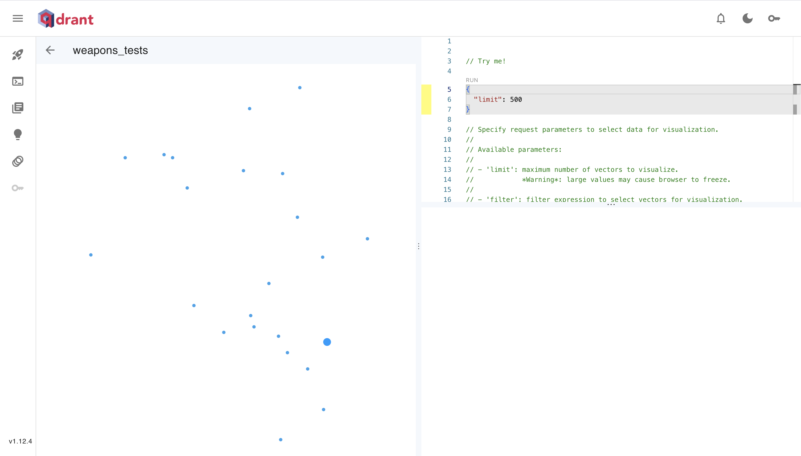

# Spis Treści

- [Spis Treści](#spis-treści)
- [AI\_devs3-Zadania](#ai_devs3-zadania)
  - [PreworkApi](#preworkapi)
  - [S01E01 — Interakcja z dużym modelem językowym](#s01e01--interakcja-z-dużym-modelem-językowym)
  - [S01E02 — Przygotowanie własnych danych dla modelu](#s01e02--przygotowanie-własnych-danych-dla-modelu)
  - [S01E03 — Limity Dużych Modeli językowych i API](#s01e03--limity-dużych-modeli-językowych-i-api)
  - [S01E04 — Techniki optymalizacji](#s01e04--techniki-optymalizacji)
  - [S01E05 — Produkcja](#s01e05--produkcja)
  - [S02E01 — Audio i interfejs głosowy](#s02e01--audio-i-interfejs-głosowy)
  - [S02E02 - Rozumienie obrazu i wideo](#s02e02---rozumienie-obrazu-i-wideo)
  - [S02E03 — Generowanie i modyfikacja obrazów](#s02e03--generowanie-i-modyfikacja-obrazów)
  - [S02E04 — Połączenie wielu formatów](#s02e04--połączenie-wielu-formatów)
  - [S02E05 — Multimodalność w praktyce](#s02e05--multimodalność-w-praktyce)
  - [S03E02 — Wyszukiwanie Semantyczne](#s03e02--wyszukiwanie-semantyczne)

# AI_devs3-Zadania

Moje rozwiązania do zadań z kursu AI_devs3.  
Gdy spisuję moje rozwiązania i przemyślenia to więcej wynoszę z nauki 😃

## PreworkApi

Zadanie polegało na przetestowaniu komunikacji z API, którego będziemy używać w dalszych zadaniach.  
Była do dla mnie świetna okazja, żeby nauczyć się korzystać z [Cursor IDE](https://www.cursor.com/).

Moje rozwiązanie: [PreworkApi](./dotnet/PreworkApi/Program.cs)

Jestem pod wrażeniem, jak przyjemnie programowało mi się z pomocą AI.
Do tej pory używałem trochę GitHub Copilot, ale nie byłem pod jakimś dużym wrażeniem.
Teraz gdy użyłem znacznie bardziej zintegrowanego z AI narzędzia, czułem się bardzo fajnie.
AI sprawdziło się bardzo dobrze, może dlatego, że zadanie było dość prostsze, jednak zawsze w pracy są też prostsze czynności, które często są nudne.
Chciałbym częściej używać do nich AI.

## S01E01 — Interakcja z dużym modelem językowym

Zadanie polegało na automatyzacji procesu logowania z użyciem AI do rozwiązywania pytań ANTY CAPTCHA - to jak CAPTCHA, ale może je przejść tylko robot 🤖.

Moje rozwiązanie: [S01E01](./dotnet/S01E01/Program.cs)

W implementacji wykorzystałem:

- HtmlAgilityPack do parsowania strony i wydobycia pytania
- OpenAI API (model GPT-4) do analizy pytania i generowania odpowiedzi
- HttpClient do komunikacji z API
- Dependency Injection do zarządzania zależnościami
- User Secrets do bezpiecznego przechowywania kluczy API i danych logowania

Ciekawe było wykorzystanie System Message w OpenAI API, który wymusza zwracanie wyłącznie liczby, bez dodatkowych wyjaśnień. To pokazuje, jak ważny jest odpowiedni prompt engineering w pracy z AI.

## S01E02 — Przygotowanie własnych danych dla modelu

Zadanie polegało na wykorzystaniu modelu językowego do przetwarzania i analizy wiadomości w dwóch krokach.

Moje rozwiązanie: [S01E02](./dotnet/S01E02/Program.cs)

W implementacji zastosowałem ciekawe podejście wykorzystujące sekwencyjne połączenie dwóch promptów, gdzie:

- Pierwszy prompt przygotowywał dane dla drugiego
- Model efektywnie pracował z własnymi wynikami
- Większość kodu została wygenerowana przez Cursor IDE, co pokazuje potencjał AI w codziennej pracy programisty

To doświadczenie pokazało, jak skuteczne może być łączenie różnych technik prompt engineeringu oraz wykorzystanie narzędzi AI do wspomagania procesu programowania.

## S01E03 — Limity Dużych Modeli językowych i API

Zadanie polegało na analizie dużego pliku z pytaniami i poprawienie w nim błędów.

Moje rozwiązanie: [S01E03](./dotnet/S01E03/Program.cs)

Głównym wyzwaniem była wielkość pliku wejściowego — zbyt duża, by przekazać całość do modelu językowego.
Zastosowałem więc podejście hybrydowe:

- Obliczenia matematyczne wykonałem programistycznie, bez użycia LLM
- Model językowy wykorzystałem tylko do analizy pytań i generowania odpowiedzi na podstawie wcześniej obliczonych wyników

To pokazuje, jak ważne jest odpowiednie rozdzielenie zadań między tradycyjne programowanie a AI, szczególnie przy ograniczeniach technicznych modeli językowych.

## S01E04 — Techniki optymalizacji

Zadanie polegało na napisaniu promptu, który nakieruje robota do celu, omijając przeszkody.
Wykorzystanie do tego LLM okazało się zaskakująco trudne.
Na początku próbowałem zrobić to bez wyznaczania konkretnej trasy modelowi, jednak bez skutku.
Na razie rozwiązałem to zadanie w łatwiejszej wersji, gdzie model miał podążać za z góry ustaloną trasą.
Moje rozwiązanie to [definedTrackSolution](prompty/S01E04/definedTrackSolution.txt).

## S01E05 — Produkcja

W tym zadaniu należało wykorzystać lokalnie uruchomiony model językowy do anonimizacji tekstu poprzez ocenzurowanie wrażliwych danych (imion, nazwisk, nazw miast, ulic i wieku).

Moje rozwiązanie wykorzystało:

- Model llama2 uruchomiony lokalnie przez [ollama](https://ollama.com/) w kontenerze Docker
- Dwuetapowe podejście do rozwiązania problemu:
  1. Wykorzystanie modelu tylko do identyfikacji wrażliwych danych w tekście
  2. Programistyczna zamiana zidentyfikowanych fragmentów na "[CENSORED]" przy pomocy prostych operacji na tekście

Początkowo próbowałem rozwiązać problem jednym promptem, który miał zarówno identyfikować jak i zamieniać dane, ale model miał z tym problemy. Podzielenie zadania na dwa prostsze kroki znacząco poprawiło skuteczność rozwiązania.

Interesująco było też to, że model początkowo odmawiał "cenzurowania" danych ze względów etycznych, ale zaakceptował zadanie gdy zostało ono przedstawione jako "anonimizacja" danych.

Kod rozwiązania: [S01E05](./dotnet/S01E05/Program.cs)

## S02E01 — Audio i interfejs głosowy

Zadanie polegało na wygenerowaniu transkrypcji z plików audio z zeznaniami świadków oraz wykorzystanie modelu do przeanalizowania ich w celu ustalenia pewnego konkretnego adresu.

Tym razem dla odmiany zdecydowałem się użyć pythona.
Generowanie transkrypcji: [S02E01](python/S02E01/transcribe.py)  
Podczas pracy z modelem whisper w pythonie miałem kilka kłopotów. Najpierw ze zbyt nową wersją pythona, a potem z wersją numpy.
Już od paru lat nie używałem pythona, więc znalezienie rozwiązania mogłoby mi zając sporo czasu.
Cursor na szczęście niezwykle sprawnie podsunął mi gotowe rozwiązania :D

Mając gotowe transkrypcje również przy pomocy Cursor'a przeanalizowałem je i znalazłem odowiedź.  
Mój prompt: [prompt.txt](python/S02E01/prompt.txt)

Co ciekawe najpierw uruchmiłem go na modelu gpt-4o. Model ten dał znacznie gorszy wynik niż claude-3.5-sonnet.

## S02E02 - Rozumienie obrazu i wideo

Zadanie polegało na odnalezieniu miasta na podstawie czterech fragmentów mapy, z których jeden był celowo błędny. Wykorzystałem model gpt-4o do analizy obrazów i znalezienia odpowiedzi.

Moje rozwiązanie: [S02E02](./dotnet/S02E02/Program.cs)

W implementacji wykorzystałem:

- OpenAI API z modelem gpt-4o do analizy obrazów map
- Trzy etapowe podejście:
  1. Analiza każdego fragmentu mapy osobno w celu wydobycia kluczowych informacji
  2. Wygenerowanie zestawów map z jedną wykluczoną.
  3. Połączenie informacji i identyfikacja niespójnego fragmentu w celu znalezienia właściwego miasta

Na początku próbowałem podać wszystkie fragmenty mapy, łącznie z błędnym do zapytania, nie dostałem jednak w ten sposób poprawnej odpowiedzi.
Uznałem, że skoro zapytania tekstowe są stosunkowo tanie i szybkie to mogę zrobić ich kilka, w każdym eliminując jeden z fragmentów mapy.

Tym razem Cursor kiepsko radził sobie z pisaniem kodu do zapytań OpenAI. Mimo dodania do kontekstu dokumentacji musiałem samemu ją przeczytać i napisać poprawny kod.

## S02E03 — Generowanie i modyfikacja obrazów

Zadanie polegało na wygenerowaniu obrazu robota na podstawie chaotycznych zeznań osoby, która go widziała. Wykorzystałem do tego DALL-E 3 poprzez OpenAI API.

Moje rozwiązanie: [S02E03](./dotnet/S02E03/Program.cs)

W moim rozwiązaniu:

1. Pobrałem zeznania świadka
2. Przy pomocy LLM przekształciłem je na opis robota
3. Wygenerowałem prompt do generacji obrazu
4. Stworzyłem obraz robota

Przy okazji rozwiązania tego zadania dowiedziałem się, że OpenAI pozwala wygenerować obraz, do którego pobrania otrzyma się URL. Dzięki temu nie musiałem samemu hostować pliku obrazu :D

## S02E04 — Połączenie wielu formatów

Celem zadania było znalezienie raportów zawierające informacje o schwytanych ludziach lub o śladach ich obecności oraz o naprawionych usterkach hardwarowych, oraz przygotowanie listy tylko tych dotyczących schwytanych ludzi, oraz oddzielnie tych, które dotyczyły usterek.
Dane w raportach były w formatach tekstowych, audio oraz graficznych.

Główny kod: [S02E04](./dotnet/S02E04/Program.cs)
Moje prompty: [Prompts](./dotnet/S02E04/Prompts.cs)

Rozwiązałem zadanie następująco:

1. Przekształciłem dane do formatu tekstowego
   - text — bez transformacji
   - audio — transkrypcja modelem _Whisper_
   - zdjęcia — ekstrakcja tekstu za pomocą _gpt-4o_
2. Użyłem modelu _gpt-4o_ do analizy raportów i kategoryzacji ich na:
   - raporty o schwytanych ludziach
   - raporty o usterkach technicznych
   - pozostałe
3. Przygotowałem odpowiedź w wymaganym formacie JSON

Dodatkowo zaimplementowałem cache dla transformacji obrazów i audio. Dzięki temu nie musiałem powtarzać tych kosztownych operacji przy dopracowywaniu aplikacji oraz miałem łatwy wgląd w ich postać tekstową.

Rozwiązanie pokazuje, jak skutecznie można łączyć różne modele AI do przetwarzania danych w różnych formatach oraz jak ważna jest optymalizacja w przypadku kosztownych operacji AI.

## S02E05 — Multimodalność w praktyce

Celem zadania było autonomicznie odpowiedzenie na pytania na podstawie informacji z artykułu internetowego.  
Częścią wyzwania było to, że artykuł, jak to strony w internecie, był w formacie HTML z linkami do zdjęć i plików audio.

Moje rozwiązanie: [S02E05](./dotnet/S02E05/Program.cs)

Moje rozwiązanie wykorzystuje:

- Zastosowanie serwisu [Firecrawl](https://www.firecrawl.dev/) do pobrania artykułu jako Markdown
- Parser markdown do wyodrębniania referencji do plików audio
- GPT-4o do wygenerowania opisu zdjęć
- Model Whisper do transkrypcji plików dźwiękowych
- Cache'owanie opisów zdjęć i transkrypcjach, żeby uniknąć powtarzania tych operacji
- GPT-4o do odpwiedzi na pytania na podstawie wiedzy z przygotowanego artykułu

Celowo przekonwertowałem artykuł na format Markdown przed przesłaniem go do modelu. Ten format dalej lepsze wyniki niż treść w HTMLu.

## S03E02 — Wyszukiwanie Semantyczne

Zadanie polegało na wykorzystaniu bazy wektorowej do znalezienia odpowiedniego raportu na podstawie zadanego pytania. Wykorzystałem do tego:

- Bazę wektorową Qdrant uruchomioną lokalnie w kontenerze Docker
- Model OpenAI text-embedding-3-small do generowania embeddingów

Kod rozwiązania: [S03E02](./dotnet/S03E02/Program.cs)

W moim rozwiązaniu:

1. Przygotowałem kolekcję w bazie Qdrant o nazwie "weapons_tests"
2. Wczytałem raporty z testów broni z plików tekstowych
3. Wygenerowałem embeddingi dla każdego raportu przy pomocy modelu OpenAI
4. Zapisałem wektory wraz z metadanymi (data raportu) do bazy Qdrant
5. Dla zadanego pytania wygenerowałem embedding i wykonałem wyszukiwanie wektorów najbardziej podobnych

Było to moje pierwsze doświadczenie z bazami wektorowymi. Szczególnie interesujące było to, jak baza potrafi znajdować semantycznie podobne dokumenty, nawet jeśli nie zawierają dokładnie tych samych słów, co zapytanie.

Wygenerowałem wizualizację podobieństwa wektorów w mojej bazie :D

